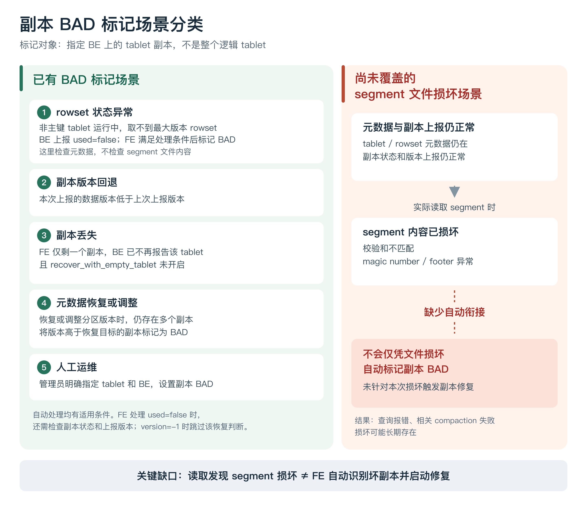
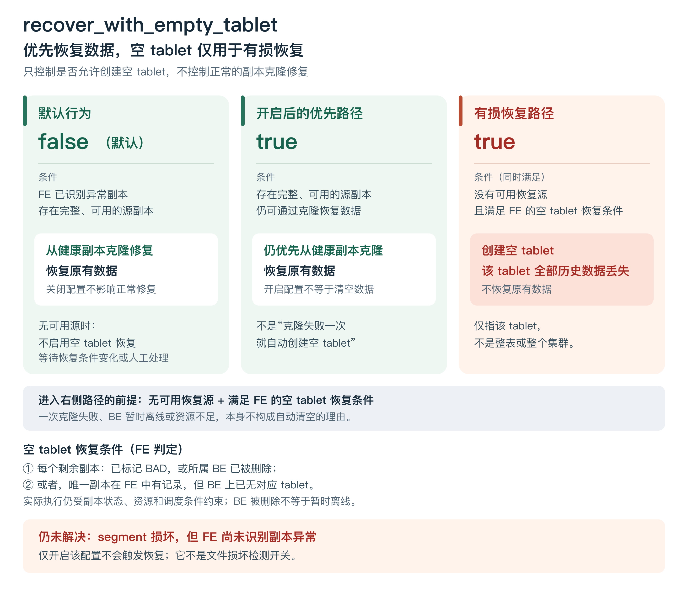
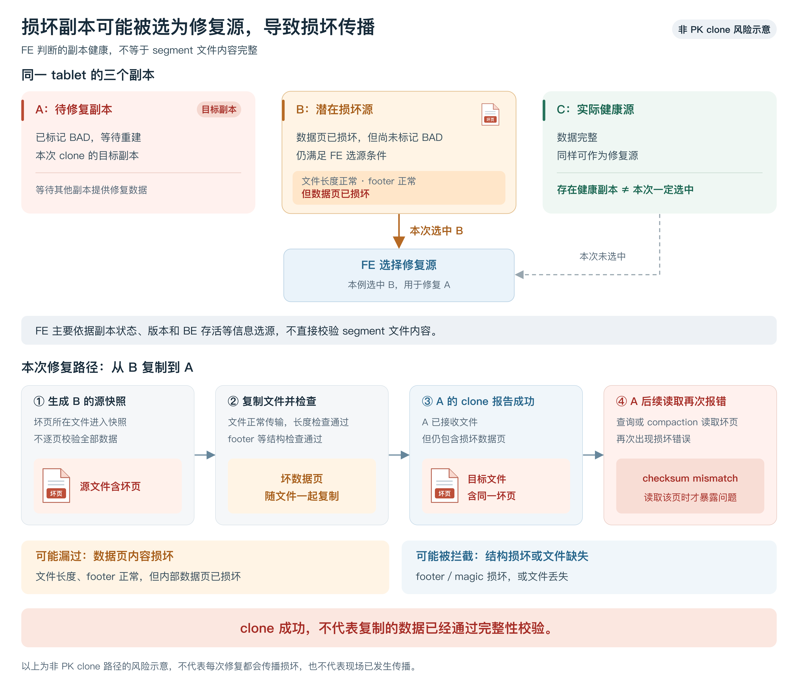
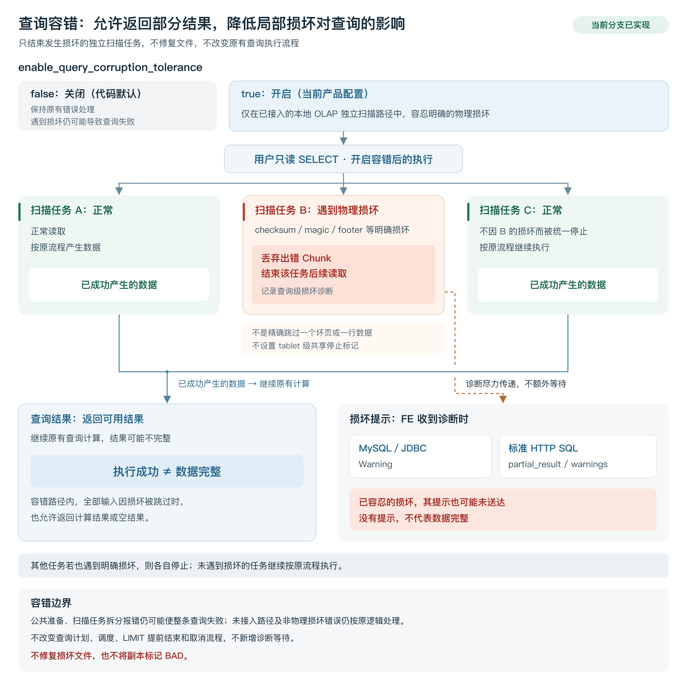
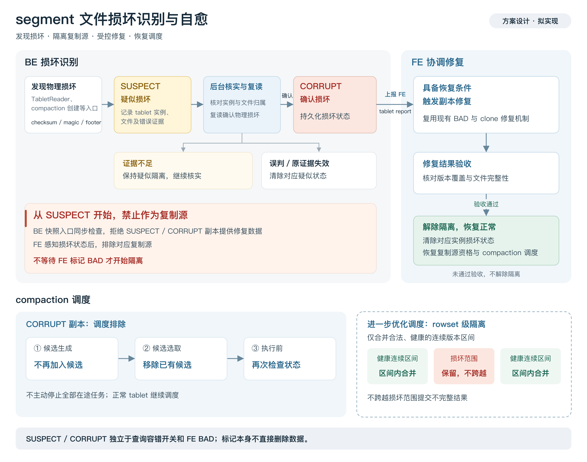

# 明细表segment文件损坏处理方案

## 1. 问题背景

在磁盘故障、RAID5 单盘离线后重新上线但未完成重建等存储异常场景下，StarRocks BE 的 segment 文件可能发生局部损坏。即使配置了多副本，此类损坏也可能未触发副本故障识别和自动修复，导致读取相关数据时查询报错、compaction 失败。面向日志明细检索业务，需要在明确接受部分结果的前提下提供查询容错，并逐步补齐损坏发现、告警和安全自愈能力，兼顾查询可用性与数据健康。

## 2. 当前现状

### 2.1 segment 文件损坏未自动转为副本 BAD，导致故障持续存在

StarRocks 已具备从健康副本克隆数据、重建异常副本的能力。但 FE 的副本健康判断主要依赖副本状态、版本及 BE 上报信息，不能直接代表 segment 文件内容完整。

当前设置副本 BAD 的场景主要分为以下几类。这里的“副本”指**指定 BE 上的 tablet 副本**，不是整个逻辑 tablet。

其中，`used=false` 反映的是特定的 rowset 元数据状态异常，不是通用的文件损坏标识。即使上报了 `used=false`，FE 也并非无条件设置 BAD，例如同时上报 `version=-1` 时，会跳过这条恢复判断。

**本方案关注的缺口是：rowset 元数据和版本记录仍然存在，但其对应的 segment 文件已经损坏。BE 能正常上报副本信息，实际读取文件时却失败，文件损坏没有自动转化为副本修复的触发条件。**

这一缺口带来的结果是：

- 查询命中损坏数据时可能失败，后续查询仍可能反复遇到同一问题。
- 读取损坏数据的 compaction 同样会失败，反复尝试可能消耗共享资源，影响正常任务。
- 即使其他副本保有可用数据，也可能无法针对这次文件损坏自动启动修复。

人工确认损坏并设置对应副本 BAD 后，在存在完整、可用的源副本且满足调度条件时，可以利用已有机制完成克隆修复。因此，当前问题不是缺少副本重建能力，而是**缺少从 segment 文件损坏识别到副本修复的自动衔接**。

### 2.2 `recover_with_empty_tablet` 无法解决未被识别的文件损坏

`recover_with_empty_tablet` 默认关闭。它不控制常规的健康副本克隆修复：即使保持默认值 `false`，FE 仍可在识别出异常副本后，从其他完整、可用的副本克隆数据完成修复。

**该配置不是自动修复的总开关，而是“是否允许以空 tablet 恢复服务”的开关。**

将其设置为 `true` 后，额外允许在以下场景中创建空 tablet：

| 场景 | FE 已经观察到的条件 | 处理方向 |
|---|---|---|
| 仅剩一个副本，该副本不可恢复 | 副本已标记 BAD，或者所属 BE 已从集群元数据中删除 | 允许调度创建空 tablet |
| 尚有多个副本，但全部被判定不可恢复 | 每个副本都满足“已标记 BAD”或“所属 BE 已被删除”之一 | 先清理异常副本记录，再进入空 tablet 恢复流程 |
| 仅剩一个副本，但 BE 上已经没有该 tablet | FE 保留副本记录，而 BE 的 tablet 上报中已不存在它，并满足相应状态检查 | 可以直接发起空 tablet 创建，不要求先设置 BAD |

上述场景需要注意以下边界：

- **“仅剩一个副本”指 FE 当前只剩一条副本记录**，不一定是表原本配置了单副本。
- **BE 被删除不等于 BE 暂时离线。** 心跳失联本身不能直接等同于上述永久丢失判断。
- **允许创建不等于立即成功**，仍受目标 BE、磁盘空间和调度等条件约束。
- **这些条件是 FE 基于副本状态和上报信息作出的判断**，不代表已经逐个检查并确认所有副本的物理文件都无法恢复。

如果只有一个副本 BAD、其他副本仍可作为恢复源，应走健康副本克隆修复，并不需要开启该配置。空 tablet 恢复则不恢复原有数据，而是接受整个 tablet 范围的历史数据缺失，并非只跳过损坏的 segment。

**本场景的首要问题是：该配置依赖 FE 已掌握的异常状态，不负责检测 segment 文件损坏。** 若只是文件内容损坏，副本仍正常上报且未标记 BAD，也没有进入上述副本丢失处理路径，开启配置仍然不会因此启动恢复。

因此，该配置既不能补齐文件损坏的识别缺口，也不能替代基于健康副本的数据修复。

### 2.3 损坏副本可能被选为修复源，导致损坏传播

FE 选择修复源时，主要依据副本状态、版本及 BE 存活情况，**不直接校验 segment 文件内容**。因此，已经发生文件损坏、但尚未标记 BAD 的副本，仍可能被当作健康源，用于修复其他副本。

现有 clone 流程包含文件长度检查和部分结构检查，但不保证逐页校验全部数据。对于**文件长度和 footer 正常、仅数据页损坏**的情况，坏数据可能被复制到目标副本，且 clone 仍报告成功；目标副本在后续查询或 compaction 读取该页时才暴露问题。footer、magic 损坏或文件丢失则可能在复制过程中被拦截，不能将所有损坏情况一概而论。

例如，同一 tablet 的 A 副本已标记 BAD，B 副本存在未被识别的坏页，C 副本实际健康。若 FE 选择 B 修复 A，就可能将 B 的损坏复制到 A，**即使存在健康副本 C，也不保证本次修复使用了它**。

因此，后续自愈方案不能仅以“标记 BAD、clone 成功”作为恢复完成的依据，还需要考虑：

- 已发现损坏的副本，如何及时禁止其作为修复源。
- 实际用于修复的数据，如何校验完整性并验收。

上述是代码允许出现的风险路径，不代表现场已经发生损坏传播。

## 3. 解决方案

本章为初步对齐稿，后续继续细化。第 3.1 节描述当前分支已实现的查询容错，第 3.2 节描述拟实现的自愈方案，不代表相关能力已经完成。

### 3.1 查询容错：允许返回部分结果，降低局部损坏对查询的影响

当前分支已实现查询容错，通过 `enable_query_corruption_tolerance` 控制。代码默认值为 `false`，当前产品配置文件中设置为 `true`。

- **关闭时**：已接入的读取路径保持原有错误处理，遇到文件损坏时返回错误。
- **开启时**：用户查询在已接入的本地 OLAP 独立扫描任务中遇到明确的物理损坏，可以结束出错任务的读取，让其他扫描任务继续执行，避免仅因该错误导致整条查询失败。

容错以**独立扫描任务**为边界：丢弃出错批次，并停止该任务后续读取，不承诺只跳过损坏的数据页或数据行。因此，返回结果可能缺少部分数据；即使所有相关输入均因损坏而无法读取，也允许按剩余输入返回结果或空结果。

结果提示支持两种访问方式：

- MySQL/JDBC：通过 Warning 提示。
- 标准 HTTP SQL：通过 `partial_result`、`warnings` 字段提示。

提示信息沿现有执行通道尽力传递，不增加额外完成等待。**没有收到提示，不代表数据一定完整。**

该能力不改变原有查询计划、调度、LIMIT 提前结束和取消流程，也不对写入、compaction、clone 等任务开放容错。共享准备阶段、未接入的执行路径及非物理损坏错误，仍按原逻辑处理。Query Cache 暂沿用现有实现，部分结果的缓存正确性问题另行处理。

**查询容错解决的是读取可用性，不修复损坏文件，也不将副本标记为 BAD。**

### 3.2 自愈：发现损坏、隔离复制源，确认后触发受控修复

后续拟增加独立的副本物理损坏状态，将损坏发现、复制源隔离、告警、修复及验收连接起来。该状态不受查询容错开关控制，也不直接等同于 FE 的 BAD 标记。

#### （1）捕获损坏证据，先疑似隔离，再确认损坏

在 `TabletReader`、compaction 任务创建等入口捕获明确的物理损坏证据，例如数据页校验和不匹配、segment magic 或 footer 异常。超时、取消、资源不足等一般运行错误，不直接认定为文件损坏。

首次发现后，将对应副本置为 `SUSPECT`，记录 tablet 实例、rowset／segment 标识及错误信息，并立即禁止其作为复制源。读取现场只进行轻量记录，不同步执行复读或全量校验。

后台核验包括：

- 确认事件仍属于当前 tablet 实例，避免误伤已经重建的新副本。
- 核对文件归属及引用关系，避免将已失效文件的历史错误归到当前副本。
- 对相关文件或数据页复读校验，必要时绕过相关缓存，确认物理损坏。

确认损坏后，持久化为 `CORRUPT`，通过现有 tablet report 通道扩展独立状态上报 FE。明确排除损坏或确认原证据已失效后，可以解除对应疑似状态；暂时无法确认时，保留复制源隔离并继续核验。

| 状态 | 含义 | 主要处理 |
|---|---|---|
| `SUSPECT` | 已捕获损坏证据，尚待确认 | 禁止作为复制源，后台核验，不直接设置 BAD 或删除数据 |
| `CORRUPT` | 已确认物理损坏 | 持久化、上报 FE、告警、排除 compaction 调度，并进入修复评估 |

#### （2）隔离复制源，防止损坏通过 clone 扩散

复制源隔离不能等到 FE 真正执行 BAD 重建时才生效。

BE 应在快照创建和对外提供等入口同步检查损坏状态，拒绝 `SUSPECT`、`CORRUPT` 副本作为复制源。即使 FE 尚未收到最新状态，BE 也应阻止其继续提供修复数据。FE 收到损坏状态后，同步排除相应复制源候选。

对于尚未报告损坏的候选源，不能直接视为已经验证健康。修复应校验**本次实际使用的快照数据**，并在目标端进行完整性验收，不能只依赖文件长度检查或 clone 成功状态。

已经生成的快照和在途复制同样需要状态复核与目标端验收，不能仅靠新建快照入口的检查覆盖全部风险。

#### （3）确认恢复源后，复用现有副本修复机制

FE 收到 `CORRUPT` 状态后，先评估是否存在完整、可用的恢复源，以及是否满足修复条件。条件满足后，再将目标副本设置为 BAD，复用已有调度和克隆机制重建。

这里需要保持三个边界：

- `SUSPECT`、`CORRUPT` 标记本身不直接删除数据。
- 无可用恢复源时，不盲目将全部副本标记 BAD，也不将空 tablet 恢复作为自动自愈的兜底。
- `recover_with_empty_tablet` 与自动标记 BAD 的联动必须受到约束，避免修复流程意外转成数据清空。

修复成功必须以版本完整性和实际数据完整性验收为依据，不能仅以 clone 返回成功作为结束条件。

#### （4）对已确认损坏的副本采用 compaction 调度排除

针对 `CORRUPT` 副本，采用以下策略：

- 生成候选时，不再加入新的 compaction 候选。
- 选取任务时，移除已经存在的对应候选。
- 任务创建、执行前再次检查状态，避免状态变化期间仍启动新的合并。

不主动停止全部在途任务，也不影响其他正常 tablet 的调度。在途任务保持严格错误处理，**不能跳过坏数据后提交不完整的合并结果**。被跳过或创建失败的任务必须正确释放并发名额及合并状态。

调度排除可以减少对坏文件的无效重试，但它只是临时保护措施，不能替代修复。

#### （5）进一步优化调度

如果长期没有修复源，可进一步考虑 **rowset 级隔离**：仅合并合法、健康的连续版本区间，保留损坏范围，不跨越损坏区间伪造完整版本，也不通过丢弃坏数据来让 compaction 报告成功。

#### （6）配套告警和积压治理，验收后恢复调度

即使停止 compaction 调度，持续写入仍可能造成 rowset 和版本积累，增加查询开销，并可能触发写入版本上限。

因此需要同步告警：

- 已确认损坏及长时间未完成核验的疑似损坏。
- 无可用修复源、修复失败或长时间未完成。
- compaction 被排除的持续时间，以及 rowset、版本数和磁盘空间的积压风险。

修复后的副本通过验收后，清理对应实例的损坏状态，恢复复制源资格和 compaction 调度。验收应直接检查存储数据，不能用查询容错后的成功结果或缓存命中证明修复完成。

## 4. 计划节奏

### 4.1 分两步推进

**第一步：完成查询容错，推动文件损坏 TD 关闭。**

优先解决日志明细检索因局部文件损坏而持续报错的问题。在业务接受部分结果的前提下，完成查询容错的产品交付和验收。

TD 的关闭以约定范围内的查询可用性问题得到解决为依据，**不代表损坏文件已经恢复**。查询容错不会修复数据，也不能消除 compaction 持续失败、损坏副本被用作修复源等风险。

**第二步：评估并建设完整自愈能力。**

以第 3.2 节方案为方向，补齐损坏发现、确认、复制源隔离、受控修复和验收，恢复副本数据完整性及正常调度。

第二步不作为第一步交付的前置条件。是否投入及具体排期，需要结合故障风险、业务收益和研发成本另行决策。

### 4.2 待决策：完整自愈是否值得投入

#### （1）决策背景

按目前的业务判断，文件损坏属于极小概率事件。查询容错完成后，可以降低局部损坏对检索可用性的影响，因此完整自愈的直接收益，主要体现在**缩短数据不完整的持续时间、降低故障扩散风险，以及减少人工恢复成本**。

需要权衡的是：**是否值得为低频故障投入一套涉及多个模块、需要长期维护的自动恢复机制。**

#### （2）投入自愈能够解决什么

- **恢复数据完整性**：查询容错只是允许返回部分结果，自愈才能在存在健康恢复源时重建损坏副本。
- **结束持续性故障**：避免损坏副本长期 compaction 失败，以及由此产生的无效重试、rowset 积压和查询开销。
- **降低损坏传播风险**：隔离已发现损坏的复制源，并对修复数据进行校验，降低通过 clone 将损坏复制到其他副本的风险。
- **减少人工依赖**：降低故障定位、恢复源核验和修复操作对人工介入的要求，缩短无人值守时的故障持续时间。

但自愈有明确前提：**必须存在完整、可用的恢复数据。** 多副本不等于一定存在健康恢复源；全部副本相关数据均已损坏时，自愈不能凭空恢复原始内容。

#### （3）为什么工作量较大

完整自愈并非简单地“发现错误后设置 BAD”，还需要解决：

- 损坏证据确认，避免误判和过期证据影响新副本。
- 损坏状态持久化、上报，以及重启后的状态恢复。
- 复制源与快照隔离，避免继续传播损坏。
- 恢复源校验、修复调度和目标端验收。
- compaction 调度控制及修复后的恢复。
- 并发、重启、多副本损坏、无恢复源、修复失败等异常场景的验证。

除开发成本外，还存在持续的测试和维护成本。**自动化恢复本身也可能引入风险**：误判可能隔离正常副本，使用不可靠的恢复源可能传播损坏，不恰当的 BAD 或空 tablet 恢复联动可能扩大数据损失。

因此，不能用一个简化的“自动标记 BAD”实现，替代完整自愈所需的安全保障。

#### （4）决策建议

建议先完成查询容错交付，再根据以下因素确定完整自愈的优先级：

| 更适合暂缓投入 | 更值得优先投入 |
|---|---|
| 故障极少，影响范围有限 | 单次故障可能影响较多客户或数据 |
| 人工能够及时定位并安全恢复 | 人工定位复杂、恢复耗时较长 |
| 业务接受一定时间的部分结果 | 业务要求尽快恢复完整数据 |
| 运维响应和恢复流程成熟 | 要求无人值守、自动恢复 |
| 近期其他研发任务收益更高 | 同类故障反复发生或运维成本持续增加 |

**当前不宜仅凭“发生概率低”判定不值得投入，也不宜仅凭“追求高可用”直接承诺完整建设。** 应结合实际故障频率、影响范围、恢复耗时和人工成本，判断投入优先级。

如果暂缓自愈，需要保留明确的人工处置流程。**查询能够返回结果，不等于损坏已经处理完成。**

如果决定投入完整自愈，建议作为**独立新特性**推进，单独开展需求评审、方案设计、开发排期、测试验收和发布工作，与本次查询容错交付及文件损坏 TD 的关闭解耦。

## 5. 查询容忍实现细节

本节按已对齐的目标设计说明配置职责与部署策略。**开关仍然是 FE 配置项；调整的是配置来源——由 Operator 在部署时指定，不再在 StarRocks 随包的 `fe.conf` 中固化为 `true`。**

### 5.1 为什么由 FE 控制，而不是在 BE 直接开启

#### （1）查询容错需要区分执行目的

允许返回部分结果，是面向日志明细检索的业务选择，不能直接变成 BE 所有读取操作的统一行为。

例如：

- 用户执行明细检索，可以在接受数据不完整的前提下返回部分结果。
- `INSERT INTO ... SELECT`、CTAS 等操作，如果忽略读取损坏，可能把不完整的数据写入目标表。
- 内部任务如果忽略损坏，也可能将不完整结果用于后续处理。

**相同的存储读取能力，可能被不同类型的任务复用；是否允许容错，不能只根据“正在读数据”判断。**

FE 掌握完整的语句类型、用户请求上下文和执行目的，更适合判断本次请求是否允许启用查询容错。BE 主要负责执行下发的任务，不适合仅凭一个节点级开关，对所有读取统一放宽错误处理。

#### （2）只限制在 Pipeline 中，也不能替代 FE 的判断

Pipeline 是执行方式，不是业务类型。包含查询式扫描的写入或内部任务，也可能使用 Pipeline。

因此，**“只在 Pipeline 中容错”不等于“只对面向用户的只读 SELECT 容错”。**

仍需要 FE 在请求入口限定适用范围，避免把“不完整结果可以接受”的业务语义扩散到其他任务。

#### （3）FE 决定是否允许，BE 决定在哪里执行

采用两层控制：

- **FE：判断本次请求是否允许容错。** 配置开启且请求符合条件时，通过现有查询参数下发容错标记。
- **BE：只在已接入的独立扫描读取位置执行容错。** 同时满足请求允许、错误属于明确物理损坏等条件时，才结束出错扫描任务；其他错误仍按原逻辑处理。

这样既能限定业务范围，也能限定实际吞掉错误的位置。

**FE 开启配置，不代表所有任务都会容错；BE 收到容错标记，也不代表可以忽略所有错误。**

该方式复用现有任务下发和执行通道，不需要 BE 在报错时额外向 FE 请求许可，也不新增同步等待。

### 5.2 通过 Operator 管理部署配置

#### （1）不在 StarRocks 随包配置中默认开启

FE 代码默认值保持：

`enable_query_corruption_tolerance = false`

StarRocks 随包的 `fe.conf` 不预置该配置为 `true`，避免容错策略与软件包绑定，使所有使用该软件包的环境都被动接受部分结果。

产品环境是否开启，由部署配置决定。

#### （2）由 Operator 在部署时指定

将该开关纳入 `starrocks-kubernetes-operator` 的部署配置管理，允许部署时指定 `true` 或 `false`，并将其传递到 FE 的有效配置中。

**Operator 的部署参数默认 `true`，沿用产品默认开启策略；部署时允许显式指定 `false`。FE 代码默认值仍保持 `false`。**

| 层次 | 职责 |
|---|---|
| FE 代码默认值 | 保持 `false` |
| StarRocks 随包 `fe.conf` | 不固化默认开启策略 |
| Operator 部署配置 | 默认 `true`，允许显式指定 `false`，按集群和环境管理 |
| FE 运行时 | 读取配置，并判断哪些请求允许容错 |
| BE 查询执行 | 根据请求标记，在已接入位置执行容错 |

这里的“不在 `fe.conf` 中默认设置为 `true`”，指的是**不修改随软件交付的默认配置**。Operator 在部署时，仍可以通过生成或注入 FE 配置的方式使指定值生效。

Operator 负责配置交付，**不参与每条 SQL 的容错判断，也不直接给 BE 开启全局容错。**

#### （3）部署管理要求

- 开关取值由部署配置统一管理，避免依赖容器内手工修改。
- 同一集群各 FE 的有效取值应保持一致，避免请求连接到不同 FE 时行为不同。
- 配置更新需要明确生效方式，不能把“部署参数已修改”等同于“所有 FE 已生效”。
- 发布和验收时，应检查 FE 的实际生效值，而不只检查部署文件。

通过这种方式，可以在同一套 StarRocks 软件包下，为不同环境选择严格报错或查询容错策略。
