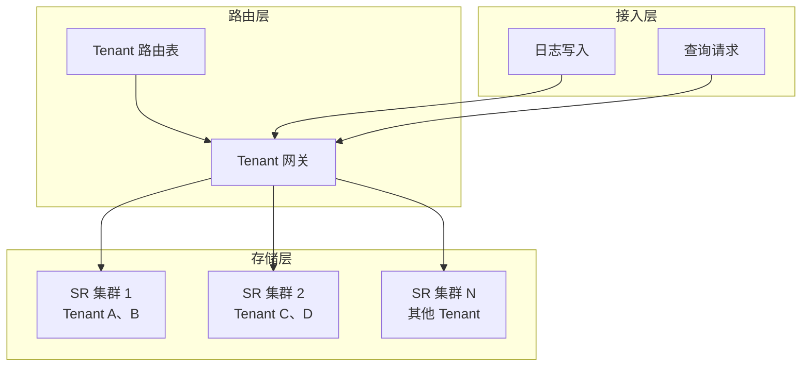

# StarRocks 多租户差异化 TTL 方案选型文档

## （0）背景

DNS 日志按照 `recordTimestamp` 持续写入，默认保留 180 天，部分 Tenant 需要更长或更短的保留周期。并假设Tenant 数量较多且数据量呈明显的二八分布：少量大 Tenant 贡献大部分数据和负载，大量小 Tenant 的数据量较小。

当前表结构如下：

```sql
CREATE TABLE `dns_log_5` (
    `qr` int(11) NOT NULL DEFAULT "0"
        COMMENT "标志位(请求0，响应1)",
    `queries` varchar(65533) NULL
        COMMENT "查询问题(查询名，多个查询以“,”分隔)",
    `tenant` varchar(65533) NULL COMMENT "",
    `recordTimestamp` bigint(20) NOT NULL DEFAULT "0" COMMENT "",
    `rawMsg` varchar(65533) NULL COMMENT "",
    `devUId` int(11) NULL COMMENT "",
    `bucketTimestamp` bigint(20) NULL
        AS (floor(`recordTimestamp` / 600)) * 600
        COMMENT "分钟级别int时间戳"
)
ENGINE=OLAP
DUPLICATE KEY(`qr`, `queries`)
PARTITION BY from_unixtime(recordTimestamp, '%Y%m%d')
DISTRIBUTED BY HASH(`recordTimestamp`) BUCKETS 3
ORDER BY(`recordTimestamp`)
PROPERTIES (
    "bloom_filter_columns" = "queries",
    "compression" = "ZSTD(3)",
    "fast_schema_evolution" = "true",
    "replicated_storage" = "true",
    "replication_num" = "1"
);
```

该表仅按自然日分区，将同一天的所有 Tenant 数据放在同一分区和 Tablet 中。存在以下两个问题：

1.只要其中一个 Tenant 尚未过期，整个日期分区就不能删除，其他 Tenant 的过期数据只能采用行级 DELETE；

2.小 Tenant 查询仍可能受到同日大 Tenant 数据量的放大影响。

## （1）推荐方案

1. 将 `tenant` 加入分区键，采用 Tenant/天复合表达式分区：

```sql
PARTITION BY (
    tenant,
    from_unixtime(recordTimestamp, '%Y%m%d')
)
```

2. 使用策略表保存 `tenant -> retention_days`，通过 Dictionary 向 `partition_retention_condition` 提供每个 Tenant 的保留天数：

策略表及 Dictionary 的完整用法如下：

```sql
CREATE TABLE dns_tenant_retention_policy (
    tenant VARCHAR(65533) NOT NULL,
    retention_days INT NOT NULL
)
PRIMARY KEY (tenant)
DISTRIBUTED BY HASH(tenant) BUCKETS 1
PROPERTIES (
    "replication_num" = "1"
);

-- 新 Tenant 由策略控制面写入默认 180 天；例外 Tenant 写入覆盖值。
INSERT INTO dns_tenant_retention_policy VALUES
    ('tenant_default', 180),
    ('tenant_small', 90),
    ('tenant_long', 365);

CREATE DICTIONARY dns_tenant_retention_dict
USING dns_tenant_retention_policy (
    tenant KEY,
    retention_days VALUE
);

-- 建表前必须等待 Dictionary 完成加载。
SHOW DICTIONARY dns_tenant_retention_dict\G
```

确认 Dictionary 状态为 `FINISHED` 后，在日志表中设置：

```sql
"partition_retention_condition" =
"coalesce(
    from_unixtime(recordTimestamp, '%Y%m%d') >=
    date_format(
        days_sub(
            current_date(),
            dictionary_get(
                'dns_tenant_retention_dict',
                coalesce(tenant, '__shadow__'),
                true
            )[1] - 1
        ),
        '%Y%m%d'
    ),
    true
)"
```

策略变更后需要刷新 Dictionary，并再次等待状态变为 `FINISHED`：

```sql
UPDATE dns_tenant_retention_policy
SET retention_days = 120
WHERE tenant = 'tenant_small';

REFRESH DICTIONARY dns_tenant_retention_dict;
SHOW DICTIONARY dns_tenant_retention_dict\G
```

Dictionary 中存在 Tenant 时，TTL 使用其 `retention_days`；暂时不存在时，外层 `coalesce(..., true)` 返回 `TRUE` 并保留分区，避免策略缺失导致误删。默认 180 天由策略控制面写入，而不是由 TTL 表达式隐式推断。

3. “保留 N 天”定义为保留包含当天在内的最近 N 个自然日分区。新 Tenant 由策略控制面写入默认 180 天策略；Dictionary 暂无该 Tenant 时安全保留数据，避免策略缺失导致误删。（这里需要在详细方案中再讨论）

4. 单集群达到分区数量达到容量水位后，可以分两个方向进行优化，在3.4章节中讨论。

## （2）关键决策点

### 关键决策 A：Tenant 是否加入分区键

| 方案 | 优点 | 缺点 |
| --- | --- | --- |
| 仅按时间分区 | <ul><li>分区数量主要由保留天数决定</li><li>FE 管理的分区和 Tablet 较少</li><li>DDL 和分区管理简单</li></ul> | <ul><li>同一天的 Tenant 共用分区和 Tablet，小 Tenant 查询会被大 Tenant 数据量放大</li><li>Tenant 查询之间的数据组织和分区裁剪隔离较差；Tenant级别数据规模如count难以利用分区元数据直接界定和估算</li><li>差异化 TTL 不能通过完整分区 DROP 实现，行级 DELETE 将查询和空间回收成本转移给 Base Compaction</li></ul> |
| Tenant/天复合分区 | <ul><li>Tenant/天成为独立生命周期单元</li><li>Tenant 等值查询可以裁剪其他 Tenant</li><li>小 Tenant 不再扫描大 Tenant 的同日数据</li><li>不同 Tenant 的数据位于不同 Tablet 集合</li><li>可以直接 DROP 过期 Tenant/天分区</li><li>不产生 Delete Predicate，也不依赖 Base Compaction 重写历史数据</li></ul> | <ul><li>分区数量约等于各 Tenant 活跃保留天数之和</li><li>每个分区固定产生 3 个 Tablet</li><li>FE 元数据内存和查询规划成本增加</li><li>BE Tablet 管理和 Compaction 调度压力增加</li></ul> |

#### 仅按时间分区时的行级 DELETE 问题推导

假设大 Tenant 保留 180 天并占据绝大部分数据，小 Tenant 保留 90 天且数据量很少。以下比例只用于说明问题：

| Tenant | 数据占比 | 保留时间 | 距今天 90 天的日期分区 |
| --- | ---: | ---: | --- |
| 大 Tenant | 99% | 180 天 | 仍需保留 |
| 小 Tenant | 1% | 90 天 | 已经过期 |

由于表只按时间分区，距今天 90 天的分区同时包含两个 Tenant。小 Tenant 到期时，大 Tenant 数据仍需继续保留约 90 天，因此不能 DROP 整个日期分区，只能执行类似的行级删除：

```sql
DELETE FROM dns_log_5
WHERE tenant = 'tenant_small'
  AND recordTimestamp < unix_timestamp(days_sub(current_date(), 89));
```

该 DELETE 的执行和影响可以分为以下阶段：

1. **写入 Delete Predicate：** DELETE 提交后，StarRocks 在受影响的共享 Tablet 上增加新版本和 Delete Predicate，逻辑上屏蔽小 Tenant 的过期行，并不会立即重写 Segment 或释放物理空间。
2. **影响共享 Tablet 的查询：** Delete Predicate 属于 Tablet 版本的一部分，而不是小 Tenant 独占的物理对象。在 Base Compaction 完成前，大 Tenant 查询仍会访问相同 Tablet，扫描路径需要加载并处理新增的版本和删除条件。即使逻辑上只删除小 Tenant，持续累积的 Delete Predicate 也可能增加大 Tenant 查询的读取与谓词处理成本。
3. **触发 Base Compaction：** 后续 Base Compaction 合并 Rowset 时应用 Delete Predicate，过滤小 Tenant 的过期行，并重写需要保留的数据。Compaction 的单位是 Tablet，无法只针对其中一个 Tenant 独立回收文件。
4. **回收收益小、重写成本高：** 在示例中，小 Tenant 只占 1%。为了回收这部分少量物理数据，Base Compaction 可能需要读取并重写同一 Tablet 中大量仍需保留的大 Tenant 数据，形成明显的读写放大。实际放大比例取决于 Rowset、Segment、数据分布和 Compaction 选择范围，不能简单等同于 99 倍，但“处理大量保留数据、只回收少量过期数据”的关系长期存在。
5. **问题持续重复：** 小 Tenant 每天都会有新的日期分区到达 90 天边界；如果不同 Tenant 还有更多保留周期，系统会在更多共享分区上反复写入 Delete Predicate，并持续把空间回收工作推给后续 Base Compaction。

因此，仅按时间分区时，Tenant 生命周期与物理删除单元不一致：一次针对小 Tenant 的少量逻辑删除，会影响共享 Tablet 的查询路径，并可能触发以大量大 Tenant 保留数据重写为代价的 Base Compaction。

**因此决策是将 Tenant 加入分区键**:

<ul><li>不加入 Tenant 带来的查询隔离和生命周期问题会长期影响性能、稳定性和容量规划，难以从根本上消除； </li>
<li>加入 Tenant 后产生的分区数量问题是规模可量化、边界可测量、能够提前治理并且有持续优化手段的容量问题。</li></ul> 

Tenant 分区提供的是数据组织、分区裁剪、Tablet 和生命周期隔离，不等价于完整的 CPU、内存和并发资源隔离。共享资源竞争仍需通过限流、Resource Group 和网关分集群治理。

### 关键决策 B：FE 内存问题

#### （1）分区数量、FE 内存与容量规划

这里讨论的是单张分区表内部的业务分区数量，而不是表的数量。每新增一个 Tenant/天分区，FE 都需要维护 Partition、Materialized Index、Tablet、Replica、分区值和映射关系等元数据，因此分区和 Tablet 数量增加会扩大 FE Heap、Tablet Inverted Index、Checkpoint 和元数据恢复压力。

在 StarRocks 4.1.3 的单容器测试中，50,000 个业务分区对应 150,000 个业务 Tablet。未显式执行 Full GC、完成全分区查询后的 FE RSS 为 8.36 GiB，FE Heap Used 为 5.79 GiB。FE 内存与分区、Tablet 数量明显相关，但不是简单线性关系；GC 时机、查询临时对象、Heap Committed 和 Native Memory 都会影响采样值。


若所有 Tenant 每天均有数据并保留 180 天，则：

```text
300 Tenant × 180 天 ≈ 54,000 个业务分区
```

因此，“8 GiB 级 FE、默认保留 180 天、约 300 个持续活跃 Tenant”可以作为当前测试条件下的粗略容量规划参考。该结论由 50,000 分区测试外推而来，不是生产硬上限；Tenant 活跃天数、Bucket 数、查询模式、物化索引和保留周期都会改变实际容量，上线前必须使用真实负载确定安全水位。

核心测试完成后，测试环境额外执行了一次显式 Full GC。GC 前与 GC 后 10 秒的变化如下：

| 指标 | GC 前（GiB） | GC 后 10 秒（GiB） | 释放量（GiB） | 降幅 |
| --- | ---: | ---: | ---: | ---: |
| FE 进程 RSS | 8.5394 | 3.3408 | 5.1986 | 60.9% |
| JVM Heap Used | 2.3415 | 1.0545 | 1.2870 | 55.0% |
| JVM Heap Committed | 7.4219 | 2.3984 | 5.0235 | 67.7% |
| Docker 容器内存 | 13.0237 | 7.9136 | 5.1101 | 39.2% |


这次附加验证表明，运行态 FE RSS 中包含大量可回收对象和可收缩的已提交堆；一次 Full GC 后，FE RSS 下降约 5.20 GiB。但 GC 后仍保留约 3.34 GiB RSS，其中同时包含存活 Java 对象、已提交堆、Metaspace、线程栈、直接内存和其他 Native Memory，不能全部解释为分区元数据。

Full GC 采样更接近长期存活对象的下界，未显式 Full GC 的测试更接近持续创建分区和执行查询时的运行压力。因此，容量规划仍应以未显式 Full GC 的结果为主要参考，不能使用 GC 后低水位直接推导生产容量。

单集群应同时以分区数、Tablet 数、FE Heap、GC、Checkpoint 和查询规划延迟设置容量水位，并提前向业务方给出 Tenant 数量和保留周期的规划指导。也可以使用更粗的时间分区控制分区数，但会同步降低 TTL 清理粒度。

#### （2）网关多集群分散

网关维护 `tenant -> SR cluster` 路由，将不同 Tenant 的写入和查询分散到多套 SR 集群。每个 FE 只管理本集群 Tenant 的分区和 Tablet 元数据，从而把全局元数据规模切分为多个可独立扩展的容量单元。



写入和查询必须使用同一份路由，单 Tenant 请求只进入一个集群。Tenant 放置不能只按数量平均，还应考虑预计分区数、数据量、写入吞吐、查询负载和 Compaction 压力。达到预警水位后停止向集群分配新 Tenant，达到迁移水位后将部分 Tenant 迁出。该方案可以直接限制单个 FE 的元数据规模，但需要额外解决表结构一致性、路由版本和 Tenant 迁移问题。

#### （3）FE 内存优化（待详细方案细化）

该部分属于待验证的 FE 内核演进方向，不代表当前版本已经具备相关能力。优化目标包括减少常驻对象数量、降低单个对象开销、控制查询临时对象，并使 FE 内存从“随全量分区明细增长”逐步转为“紧凑索引 + 有界热数据”。可以从以下方向推进：

- **减少元数据基数：** （1）当前每个 Tenant/天分区固定产生 3 个 Tablet，应根据实际数据量评估 Bucket 数；大量小 Tenant 场景可以考虑使用更少 Bucket(利用我们自适应hash桶的方案)。（2）按天分区转换成按周分区。
- **使用更紧凑的数据结构：** 将多层 Java 对象和通用 `Map`/`Set` 改为扁平数组、原生类型集合、压缩位图或紧凑的多列分区值结构，减少对象头、装箱对象、Hash 桶和指针开销。Tenant、日期、分区属性和分布描述等重复字符串或不可变对象可以采用字典编码或共享实例，避免每个分区重复保存。
- **增量维护分区索引：** 常驻维护 `tenant -> ordered(day -> partition_id)` 或通用多列分区倒排索引，在分区创建和 DROP 时增量更新。查询先按 Tenant 得到候选集合，再计算日期范围，避免每次规划都遍历全部分区并重新构造完整映射，从而同时降低规划 CPU 和临时对象分配。
- **减少全量复制和后台遍历：** TTL、统计、Checkpoint 和查询规划应复用只读视图或按批次迭代，避免复制完整 Partition ID Set、多层 Map 或分区快照。Checkpoint 和 Image 生成可以采用流式序列化，防止后台任务短时间构造另一份全量元数据。
- **冷元数据落盘并按需加载：** 内存中只保留 Table ID、Partition ID、Tenant/日期分区值、状态、版本、摘要和磁盘位置等轻量目录；历史冷分区的详细属性、Materialized Index 层级及可拆分的 Tablet/Replica 明细写入本地持久化 KV 或分页文件。查询先使用常驻索引完成分区裁剪，再批量加载候选分区明细并放入有上限的缓存。Tablet Inverted Index 和后台调度必需字段是否能够卸载，需要结合现有调度路径单独设计，不能直接全部落盘。
- **建立有界缓存和内存水位：** 最近访问、正在写入或即将过期的分区保留在内存，历史冷分区按 LRU、访问频率或内存水位淘汰；通过批量预取和顺序读取减少随机磁盘访问。达到高水位时限制大范围无 Tenant 查询、自动建分区和高开销后台任务，避免再次把全部冷元数据加载到内存。
- **保证一致性与恢复：** 分区创建、DROP 和 Schema Change 按 Edit Log 顺序更新常驻索引、磁盘明细和缓存；Follower FE 重放相同日志维护本地状态。磁盘元数据必须能够由 Image 和 Journal 重建，不能成为新的单点状态。Leader 切换、Checkpoint 和 Journal Replay 过程也不能隐式加载全部冷元数据。

紧凑数据结构和增量分区索引主要降低常驻对象及查询临时内存，改造范围相对可控；冷元数据落盘能够进一步降低 Heap，但会引入缓存未命中延迟、磁盘读放大和恢复复杂度。**建议先通过 Heap 分析确定 Partition、Tablet、Replica、字符串和临时索引的内存占比**，再按“减少基数、压缩结构、减少临时对象、冷数据落盘”的顺序验证收益。将对象移到 Off-Heap 只能降低 JVM Heap，不一定降低 FE 进程 RSS，因此不能作为独立的容量解决方案。

### 关键决策 C：Compaction 效率问题

当前结论是风险可解释，可通过三个方向缓解或规避问题。

风险可解释：
Compaction 的执行单元是 Tablet，且不能跨 Tablet 合并。因此，真正影响效率的不是分区数本身，**而是分区增加所带来的 Tablet 数量、写入碎片、小 Rowset/Segment 数量和调度开销。**
另一方面，TTL 直接 DROP 完整分区，不生成 Delete Predicate，也不需要 Base Compaction 重写历史数据，相比行级 DELETE 减少了过期数据清理产生的 Compaction 压力。


缓解方向包括：
（1）在业务或者网关层，合并小租户的写入流量，减少小文件产生。这一步可以很大程度上减少compaction压力；
（2）结合监控，提前预警compaction瓶颈，及时按需扩容 BE 或增加 Compaction 资源；
（3）优化starrocks的compaciton和write stall策略，对compaction线程资源进行分组，让更多资源集中在大租户上。并且优化write stall策略，当小租户的小文件多一点时也不会影响到前段写入流量。

后续压测需要覆盖大量小 Tenant 与少量大 Tenant 混合写入、不同导入批次大小、Compaction 队列与资源消耗，并最终确定单集群 Tablet、Rowset 和 Segment 的安全水位。
